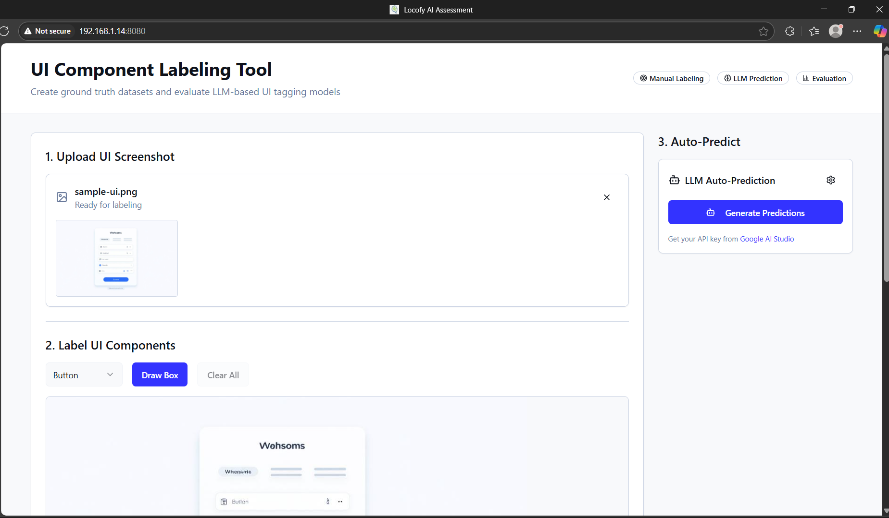
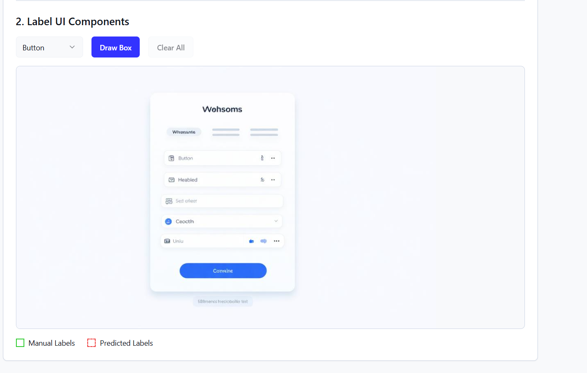
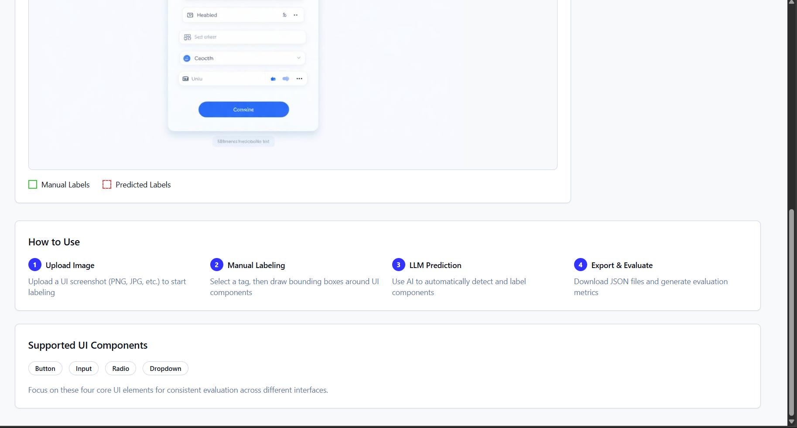

# UI Component Labeling Tool

A comprehensive web application for creating ground truth datasets and evaluating LLM-based UI component detection models. This tool enables manual labeling of UI components, automatic prediction using LLMs, and detailed evaluation metrics.

## 🎯 Features

### 1. Ground Truth Labeling
- **Image Upload**: Drag-and-drop or click to upload UI screenshots
- **Interactive Canvas**: Draw bounding boxes around UI components using Fabric.js
- **Component Tagging**: Label components as Button, Input, Radio, or Dropdown
- **Real-time Editing**: Add, delete, and modify labels with visual feedback
- **Export**: Save manual labels as structured JSON files

### 2. LLM Auto-Prediction
- **Multiple Providers**: Support for OpenAI GPT-4o, Claude 3.5, and mock demo mode
- **Custom Prompts**: Configurable prompts for different LLM providers
- **Visual Comparison**: Predicted boxes shown with dashed lines vs solid lines for manual labels
- **Batch Processing Ready**: Architecture supports processing multiple images

### 3. Evaluation & Analytics
- **IoU-based Matching**: Uses Intersection over Union (threshold: 0.5) to match predictions with ground truth
- **Comprehensive Metrics**: Precision, Recall, and F1-score for each component type
- **Overall Performance**: Aggregated metrics across all component types
- **Export Results**: Download evaluation reports as JSON files
- **Command-Line Evaluation**: Batch process folders of labels for comprehensive reporting

## 🚀 Quick Start

1. **Upload an Image**: Use the drag-and-drop area or try the sample image
2. **Manual Labeling**: Select a component type and draw bounding boxes
3. **Generate Predictions**: Click "Generate Predictions" (use mock mode for demo)
4. **Export & Evaluate**: Download ground truth, predictions, and evaluation metrics

## 📊 Command-Line Evaluation Tool

For batch processing, a powerful command-line evaluation script is included.

### 1. Folder Structure

Create two folders, for example `ground_truth` and `predictions`, and place your exported JSON files in them. The script will match files by name.

```
evaluation_data/
├── ground_truth/
│   ├── ui_screenshot_1.json
│   ├── ui_screenshot_2.json
│   └── ...
└── predictions/
    ├── ui_screenshot_1.json
    ├── ui_screenshot_2.json
    └── ...
```

### 2. Run the Script

Execute the evaluation script from your terminal, pointing it to your data folders.

```bash
# Using npm
npm i


#after that using 
npm run dev
```

### 3. Example Output

The script will print a detailed performance report to the console.

```
--- LLM Tagging Performance Evaluation ---
IoU Threshold: 0.5

Tag       | GT Count | Pred Count | TP   | FP   | FN   | Precision | Recall | F1-Score
----------|----------|------------|------|------|------|-----------|--------|---------
Button    | 50       | 52         | 48   | 4    | 2    |    92.31 |  96.00 |    94.12
Input     | 30       | 28         | 27   | 1    | 3    |    96.43 |  90.00 |    93.10
Radio     | 20       | 25         | 18   | 7    | 2    |    72.00 |  90.00 |    80.00
Dropdown  | 15       | 14         | 13   | 1    | 2    |    92.86 |  86.67 |    89.66
Overall   | 115      | 119        | 106  | 13   | 9    |    89.08 |  92.17 |    90.60
------------------------------------------------------------------------------------
```

## 🛠 Technical Architecture

### Frontend Stack
- **React + TypeScript**: Modern, type-safe component architecture
- **Tailwind CSS**: Comprehensive design system with semantic tokens
- **Fabric.js**: Interactive canvas for drawing and editing bounding boxes
- **shadcn/ui**: Beautiful, accessible UI components
- **React Dropzone**: File upload with drag-and-drop support

### Data Format

**Ground Truth JSON:**
```json
{
  "image_filename": "example_ui.png",
  "labels": [
    {
      "tag": "Button",
      "bbox": [100, 150, 200, 250]
    },
    {
      "tag": "Input", 
      "bbox": [300, 400, 450, 500]
    }
  ]
}
```

**Evaluation Metrics:**
```json
{
  "image_filename": "example_ui.png",
  "iou_threshold": 0.5,
  "summary": {
    "Button": {
      "precision": 0.875,
      "recall": 0.933,
      "f1_score": 0.903,
      "true_positives": 15,
      "false_positives": 2,
      "false_negatives": 1
    },
    "overall": {
      "precision": 0.823,
      "recall": 0.891,
      "f1_score": 0.856
    }
  }
}
```

## 🎨 Design System

The application uses a carefully crafted design system with:
- **Semantic Colors**: Primary, secondary, accent, and component-specific colors
- **Component-Specific Styling**: Manual labels (green), predicted labels (red), selected (purple)
- **Responsive Design**: Works seamlessly across desktop and mobile devices
- **Dark/Light Mode**: Automatic theme adaptation

## 🔧 LLM Integration

### Supported Providers
- **OpenAI GPT-4o**: Vision-capable model for UI analysis
- **Anthropic Claude**: Coming soon
- **Mock Mode**: Demo with randomly generated predictions

## UI
   
   
   


## 🎯 Use Cases

1. **AI Model Training**: Create labeled datasets for training UI component detection models
2. **Model Evaluation**: Compare different LLM approaches for UI understanding
3. **Automated Testing**: Generate test cases for UI testing frameworks
4. **Design Analysis**: Analyze UI patterns across different applications
5. **Accessibility Auditing**: Identify and classify interactive elements

## 🤝 Contributing

This tool is designed for AI researchers, UI/UX professionals, and developers working on automated UI analysis. The codebase is structured for easy extension and customization.

### Key Extension Points
- **New LLM Providers**: Add support in `LLMPredictor.tsx`
- **Additional Metrics**: Extend evaluation logic in `DataExport.tsx`
- **Custom Components**: Modify the tag list and add new component types
- **Export Formats**: Add support for different annotation formats

## 📄 License

This project demonstrates a complete solution for UI component labeling and evaluation, suitable for research and commercial applications in AI-driven design analysis.